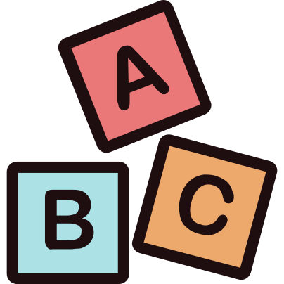
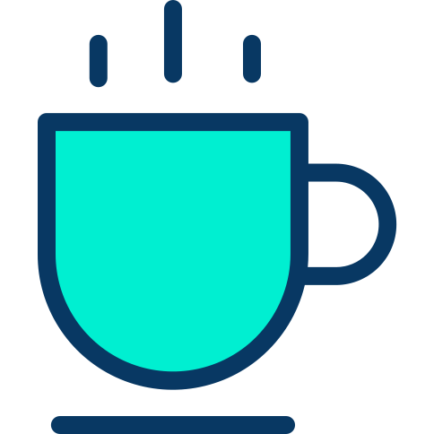
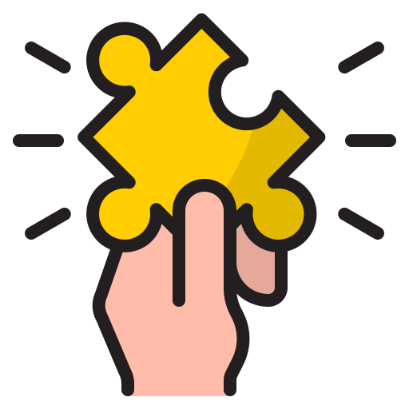

    <h1>Café Kid's Friendly</h1>
    <h5>Matthieu Balondrade</h5>

---

    <h1>Contexte</h1>

---

---

---

---

---

    <h1>Storytelling</h1>

---

## Café Kid's friendly

<iframe src="https://explee.com/fr/embed/video/mgo3eyy?" width="640" height="360"
frameborder="0" allowfullscreen="" mozallowfullscreen="true" webkitallowfullscreen="true" onmousewheel="">
</iframe>

---

## L'accès aux pédagogies alternatives 

Le client s'intéresse aux pédagogies alternatives

**Quelles solutions actuelles s'offrent à lui ?**

---

## L'accès aux pédagogies alternatives 

Le client s'intéresse aux pédagogies alternatives

**Quelles solutions actuelles s'offrent à lui ?**

* Chercher sur internet
* Lire des livres
* Acheter du matériel et expérimenter

---

## L'accès aux pédagogies alternatives 

Le client s'intéresse aux pédagogies alternatives

**Quelles solutions actuelles s'offrent à lui ?**

* Chercher sur internet
* Lire des livres
* Acheter du matériel et expérimenter

<b> 👉 Découvrir à très faible coût ces pédagogies et leur matériels associés en accès illimité</b>

---

## Un moment de détente 

Combiner les besoins des parents et des enfants.

---

## Un moment de détente 

Combiner les besoins des parents et des enfants.

<ul>
        <li style="list-style: none">
    <b> 👉 Lieu d'activité pour les enfants </b>
    </li>
</ul>

---
## Un moment de détente 

Combiner les besoins des parents et des enfants.

<ul>
        <li style="list-style: none">
    <b> 👉 Lieu d'activité pour les enfants </b>
    </li>
    <li style="list-style: none;">
    <b> 👉 Lieu de ressourcement pour les parents</b>
    </li>
</ul>

---

## Se retrouver entre idéaux 

Un point de rencontre idéal pour des parents qui souhaitent :

* Echanger avec d'autres parents
* Sortir de l'isolement
* Partager des idées

---
## Se retrouver entre idéaux 

Imaginez vous:

Attiré par la pédagogie basé sur le sensoriel:

* Découverte de la nature
* Produit naturel
* La beauté des choses simples.

---
## Se retrouver entre idéaux 

Imaginez vous:

Attiré par la pédagogie basé sur le sensoriel:

* Découverte de la nature
* Produit naturel
* La beauté des choses simples.

**Vous cherchez une nounou pour votre enfant qui partage vos idées ?**

---
## Se retrouver entre idéaux 

Imaginez vous:

Attiré par la pédagogie basé sur le sensoriel:

* Découverte de la nature
* Produit naturel
* La beauté des choses simples.

**Vous cherchez une nounou pour votre enfant qui partage vos idées ?**

<b> 👉 Echange direct sur place avec des personnes qui partagent les mêmes problématiques et besoins </b>

---

## Pas de casse tête financier 

Liberté financière.

* Paiement du temps passé (max 15€/jour/enfant avec 1 accompagnant)
* Abonnement mensuel / annuel (60€/enfant avec 1 accompagnant)